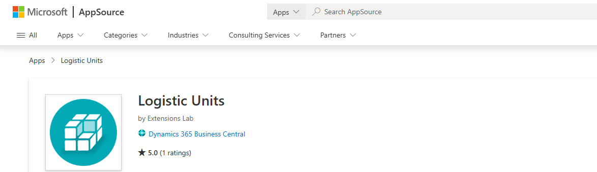

# Logistic Units for Microsoft Dynamics 365 Business Central

Logistic Units is a powerful extension for Microsoft Dynamics 365 Business Central that revolutionizes how you manage pallets, boxes, containers, and other logistics units within your supply chain operations.

[AppSource Link](https://github.com/Extensions-lab/logistic-units)

## What is Logistic Units?

Logistic Units transforms Business Central into a comprehensive logistics management system by introducing a new entity type that represents physical containers used for transportation and storage. This extension enables you to:

- **Group items into logistics units** (pallets, boxes, containers)
- **Track logistics units** throughout the entire supply chain
- **Post documents by logistics unit** instead of individual items
- **Manage SSCC numbers** for global identification
- **Control weight and volume** during loading processes
- **Track shipments** with carrier integration

### Core Functionality

The extension provides these key capabilities:

#### Logistics Unit Management

- Create and manage different types of logistics units (pallets, containers, boxes)
- Assign unique identifiers (SSCC numbers) to each unit
- Track logistics unit types with specific parameters (size, weight limits, volume limits)

#### Document Integration

- Post sales, purchase, and warehouse documents by logistics unit
- Combine multiple orders into single containers
- Maintain inventory control at the logistics unit level
- Generate packing lists and custom labels

#### Supply Chain Tracking

- Track logistics units outside company locations
- Integrate with 1000+ carriers worldwide for shipment tracking
- Monitor logistics unit history through document trails
- Control remaining quantities by logistics unit

#### Weight & Volume Control

- Enforce weight and volume limits during loading
- Prevent overloading of logistics units
- Maintain accurate capacity management

## Official Documentation

[Documantation Link](https://github.com/Extensions-lab/logistic-units-help)

This documentation is available directly from the extension.

[Documentation inside Logistic Units extension](resources/logisticunit/pics/logisticunit0.png)

## Prerequisites

- Microsoft Dynamics 365 Business Central [product page](https://www.microsoft.com/en-us/dynamics-365/products/business-central). Logistics Units is an add-on extension for Business Central that builds on its core modules—such as Customers, Sales, Vendors, Purchasing, and Warehousing—using them as a solid foundation while adding only the features necessary for logistics.
- Microsoft Dynamics 365 Business Central - Onprem

## Notes

The object range 71628575 – 71629574 is registered with Microsoft under the company Extensions Force.
The object prefix TMA is registered with Microsoft under the company Extensions Force.

When creating your own solutions based on the Logistic Units extension, you must update the object range in app.json to your own range, move all objects into that range, and remove the TMA prefix.

## How to Install

### Microsoft Dynamics 365 Business Central online

- [Directly From AppSource](https://appsource.microsoft.com/en-us/product/dynamics-365-business-central/PUBID.extensionsforcelimited1647259189111%7CAID.logisticunits%7CPAPPID.c383b772-f29f-4c05-b1ac-7801c76750af?tab=Overview) This is the official solution page. The solution is built from these source codes and published by Extensions Lab.

- [Directly in Business Central]

### On-prem

- Download source-codes
- Transfer object of this extension to your object range (for example 50000-59999) and remove prefix TMA for objects.
- Build extension
- Manualy load to Onprem Business Central
