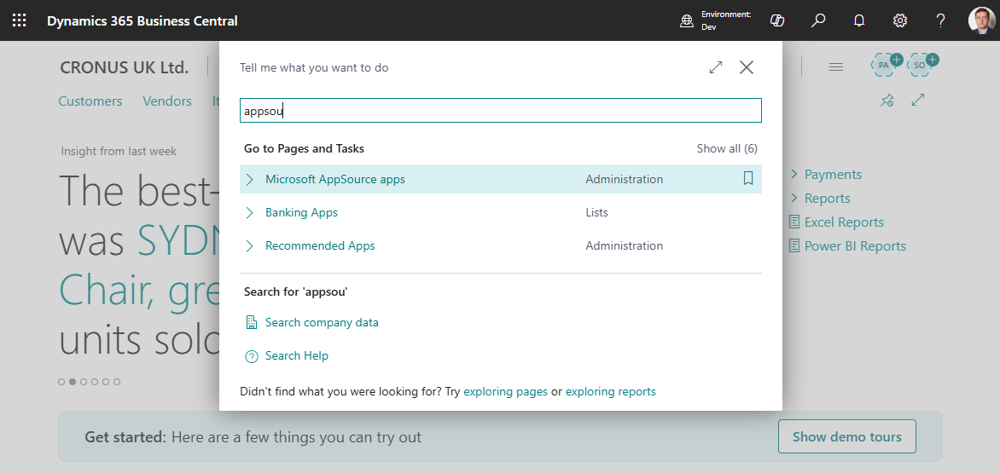
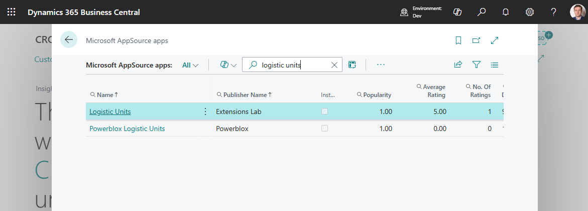
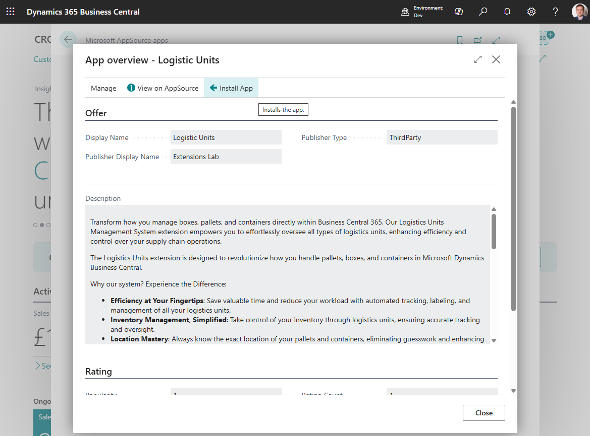
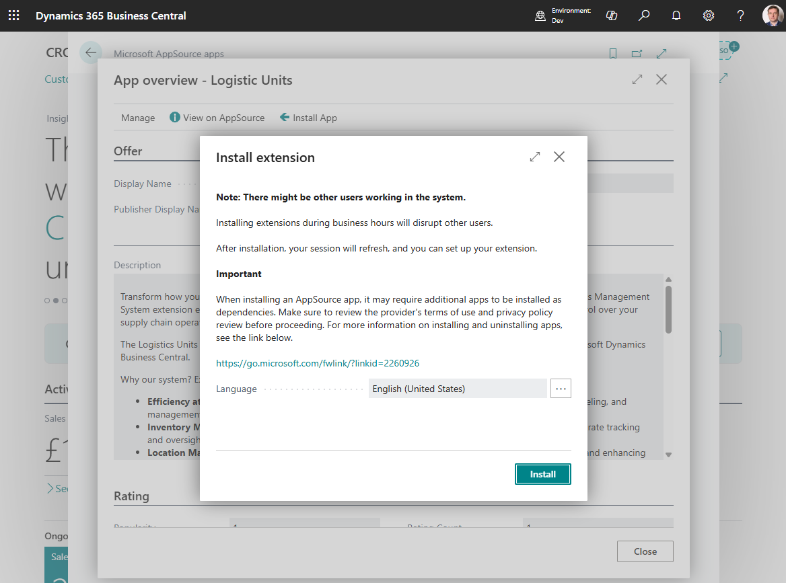
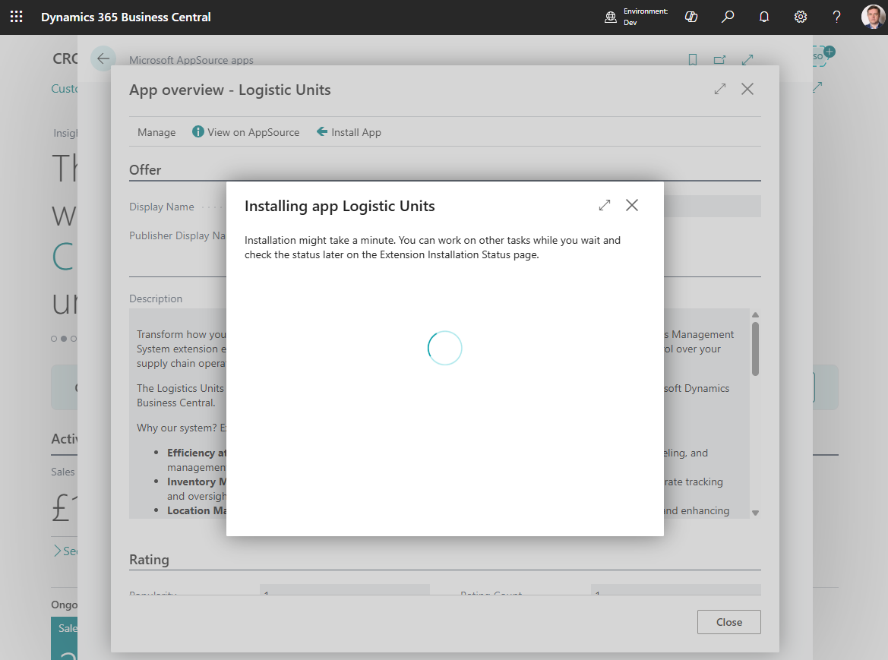
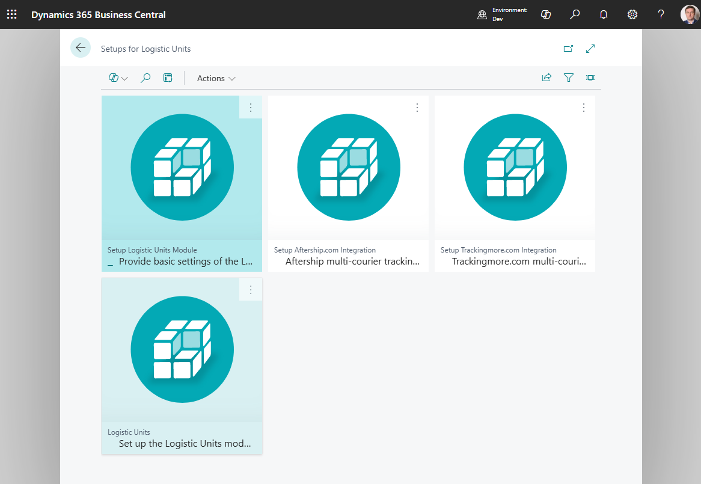

# Installation

The easiest way to install TMS is directly from within Business Central. Just search for the AppSource page.

Search "Logistic Units"

Open "Logistic Units" card page

click "Install App"

System will start a process of installation

When the installation process is complete, the system will open the setup wizards list.

